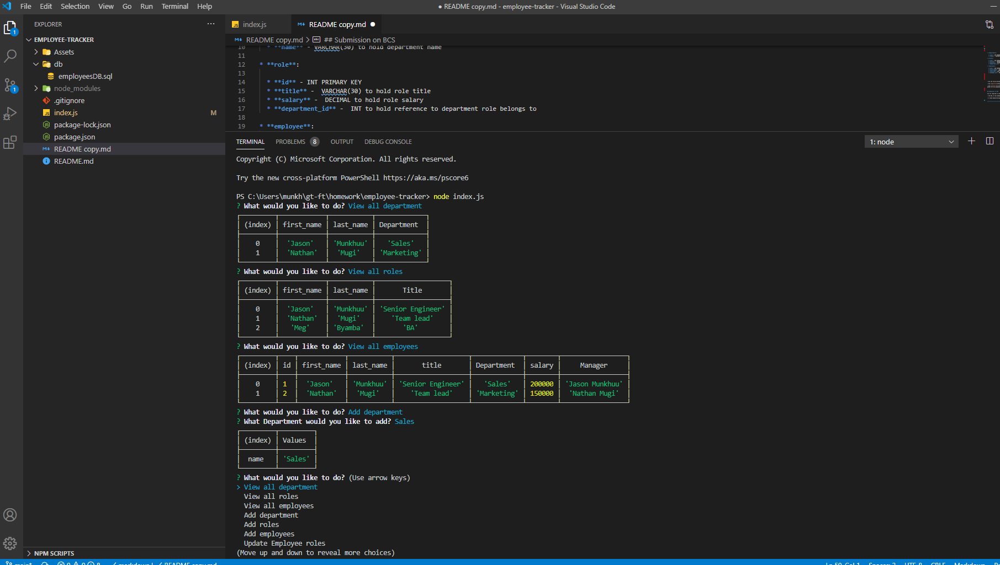

# employee-tracker

This command-line application manages a company's employees using node, inquirer, and MySQL.

* **department**:

  * **id** - INT PRIMARY KEY
  * **name** - VARCHAR(30) to hold department name

* **role**:

  * **id** - INT PRIMARY KEY
  * **title** -  VARCHAR(30) to hold role title
  * **salary** -  DECIMAL to hold role salary
  * **department_id** -  INT to hold reference to department role belongs to

* **employee**:

  * **id** - INT PRIMARY KEY
  * **first_name** - VARCHAR(30) to hold employee first name
  * **last_name** - VARCHAR(30) to hold employee last name
  * **role_id** - INT to hold reference to role employee has
  * **manager_id** - INT to hold reference to another employee that manages the employee being Created. This field may be null if the employee has no manager
  

* Used [MySQL](https://www.npmjs.com/package/mysql) NPM package to connect to your MySQL database and perform queries.

* Used [InquirerJs](https://www.npmjs.com/package/inquirer/v/0.2.3) NPM package to interact with the user via the command-line.

* Used [console.table](https://www.npmjs.com/package/console.table) to print MySQL rows to the console.  better for our purposes.

  ### Application link

* [GitHub repositories](https://github.com/mugich/employee-tracker)

### Application's appearance
